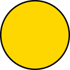

# ।। rustॐ OS ।। artwork and logos

## Color Palette

<table style="text-align:center">
	<tr>
		<th></th>
		<th width="175">RGB</th>
		<th width="175">Hex</th>
	</tr>
	<tr>
		<td></td>
		<td>(183, 65, 14)</td>
		<td>#B7410E</td>
	</tr>
	<tr>
		<td></td>
		<td>(255, 0, 0)</td>
		<td>#B7410E</td>
	</tr>
	<tr>
		<td></td>
		<td>(255, 215, 0)</td>
		<td>#B7410E</td>
	</tr>
</table>
